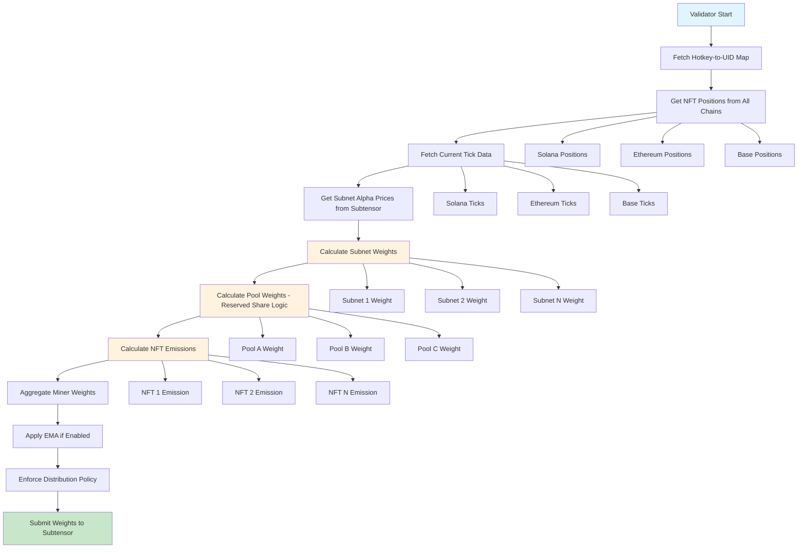
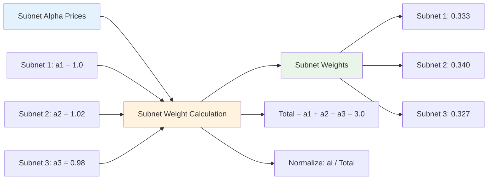
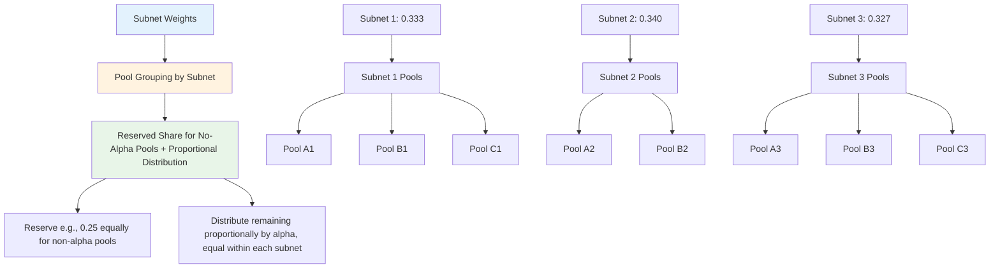
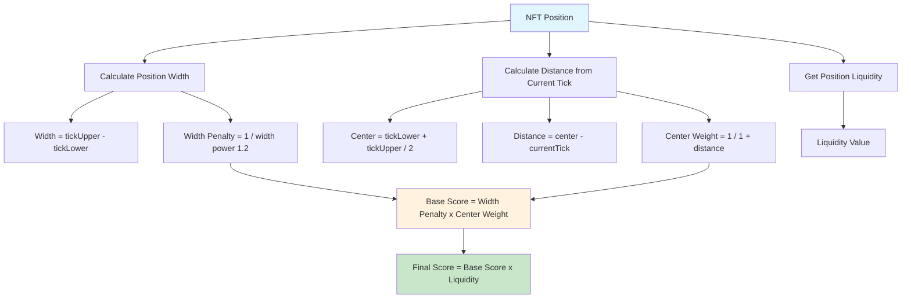
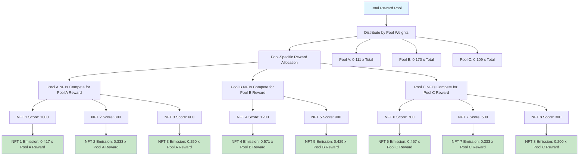
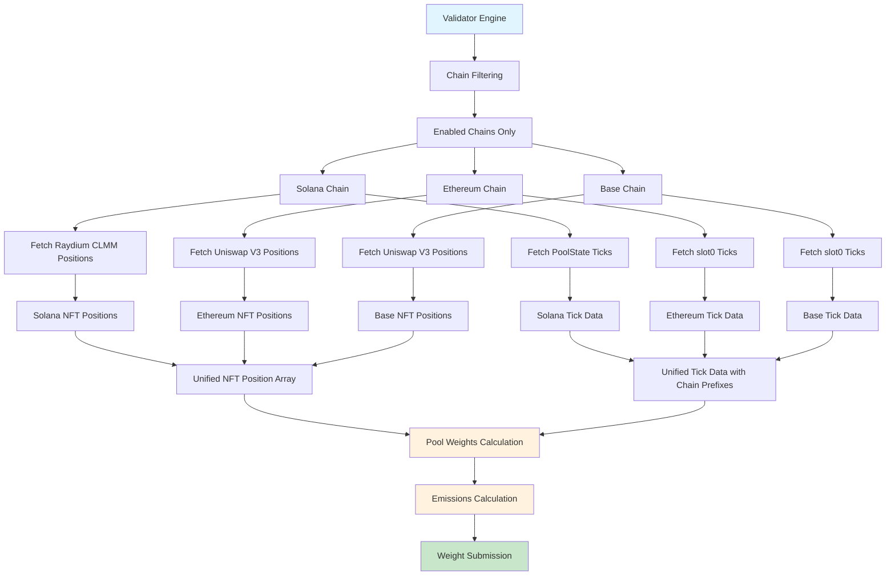
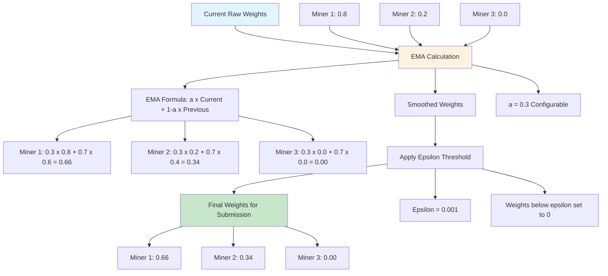
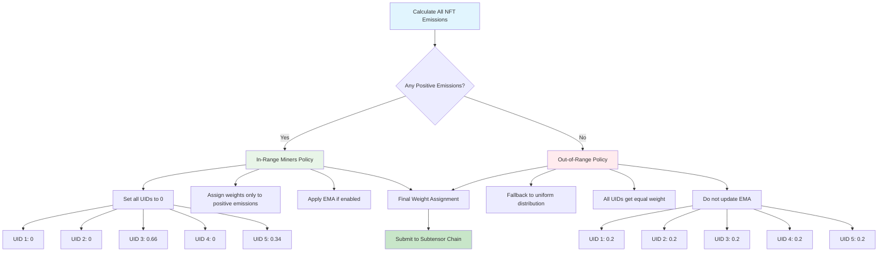
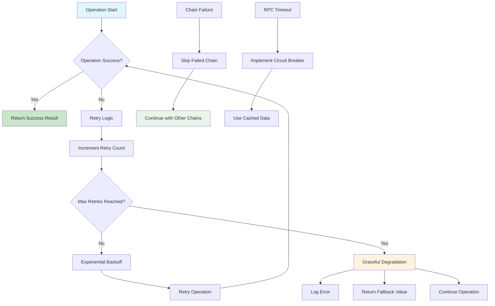
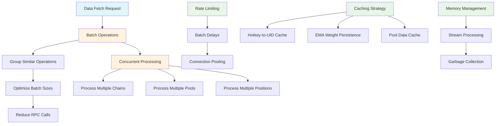

# Bittensor SN106 VoidAI Validator Architecture

## Overview

The Bittensor SN106 VoidAI Validator is a sophisticated system designed to calculate and distribute rewards to miners based on their NFT liquidity positions across supported blockchain networks. The validator implements a two-tier weighting system that considers both subnet performance (via alpha token prices) and individual NFT position characteristics.

## System Architecture

### High-Level Architecture

```
┌─────────────────┐    ┌─────────────────┐    ┌─────────────────┐
│   Subtensor     │    │   Multi-Chain   │    │   Validator     │
│     Chain       │◄──►│   Data Fetch    │◄──►│   Engine       │
└─────────────────┘    └─────────────────┘    └─────────────────┘
         │                       │                       │
         │                       │                       │
         ▼                       ▼                       ▼
┌─────────────────┐    ┌─────────────────┐    ┌─────────────────┐
│  Weight         │    │  Pool Weights   │    │  NFT Emissions  │
│ Submission      │    │  Calculation    │    │  Calculation    │
└─────────────────┘    └─────────────────┘    └─────────────────┘
```

### Core Components

1. **Validator Engine** (`validator/index.ts`)
   - Main orchestration logic
   - EMA (Exponential Moving Average) weight management
   - Reward distribution policy enforcement

2. **Multi-Chain Data Layer** (`validator/chains/`)
   - Solana Raydium CLMM integration
   - Ethereum Uniswap V3 integration **(Coming Soon)**
   - Base Uniswap V3 integration **(Coming Soon)**
   - Chain filtering and configuration

3. **Emissions Calculator** (`validator/calculations/emissions.ts`)
   - NFT position scoring algorithm
   - Pool-wise emission distribution
   - Reward calculation logic

4. **Utility Layer** (`utils/`)
   - Bittensor chain interactions (`bittensor.ts`)
   - Pool weights calculation (`poolWeights.ts`)
   - Weight submission (`setWeights.ts`)

## Architecture Diagrams

### 1. Complete Emission Calculation Flow



### 2. Subnet Weighting System



### 3. Pool Weight Distribution (Reserved-Share Logic)



### 4. NFT Position Scoring Algorithm



### 5. Pool-Wise Emission Distribution



### 6. Multi-Chain Data Flow



### 7. EMA Weight Smoothing



### 8. Distribution Policy Enforcement



### 9. Error Handling and Resilience



### 10. Performance Optimization Flow



## Diagram Summary

The architecture diagrams above provide a comprehensive visual representation of the BitTensor Subnet 106 Validator system:

1. **Complete Emission Calculation Flow** - Shows the end-to-end process from data collection to weight submission
2. **Subnet Weighting System** - Illustrates how alpha token prices determine subnet weights
3. **Pool Weight Distribution** - Demonstrates equal weight distribution within subnets
4. **NFT Position Scoring Algorithm** - Shows the factors that determine individual NFT scores
5. **Pool-Wise Emission Distribution** - Illustrates how rewards are distributed within pools
6. **Multi-Chain Data Flow** - Shows how data is aggregated from multiple blockchain networks
7. **EMA Weight Smoothing** - Demonstrates the exponential moving average calculation
8. **Distribution Policy Enforcement** - Shows the logic for in-range vs out-of-range miners
9. **Error Handling and Resilience** - Illustrates the system's fault tolerance mechanisms
10. **Performance Optimization Flow** - Shows the various optimization strategies employed


## NFT Position Scoring Algorithm

The validator uses a sophisticated scoring algorithm that considers multiple factors:

```typescript
function calculateRewardScore(position: NFTPosition, currentTick: number): number {
  const tickLower = position.tickLower;
  const tickUpper = position.tickUpper;
  
  // Check if position is in range - out-of-range positions get zero score
  const isInRange = currentTick >= tickLower && currentTick <= tickUpper;
  if (!isInRange) {
    return 0;
  }
  
  const width = tickUpper - tickLower;
  const center = (tickLower + tickUpper) / 2;
  const distanceFromCenter = Math.abs(center - currentTick);
  
  // Penalize wider ranges (more concentrated positions get higher scores)
  const widthPenalty = 1 / Math.pow(width, 1.2);
  
  // Favor positions close to current tick
  const centerWeight = 1 / (1 + distanceFromCenter);
  
  // Base score combines width penalty and center weight
  const baseScore = widthPenalty * centerWeight;
  
  // Final score incorporates liquidity
  return baseScore * position.liquidity;
}
```

**Scoring Factors:**
1. **Range Check**: Only in-range positions (currentTick within [tickLower, tickUpper]) get non-zero scores
2. **Position Width**: Narrower ranges (more concentrated) get higher scores
3. **Distance from Current Tick**: Positions closer to current tick get higher scores
4. **Liquidity**: Higher liquidity positions get proportionally higher scores

### Pool-Wise Emission Distribution

```typescript
export function calculatePoolwiseNFTEmissions(
  positions: NFTPosition[],
  currentTickPerPool: Record<string, PoolTickData>,
  poolWeights: Record<string, number>,
  totalReward: number
): NFTEmissionResult[] {
  // Group positions by pool
  const poolToPositions: Record<string, NFTPosition[]> = {};
  for (const pos of positions) {
    if (!poolToPositions[pos.pool]) poolToPositions[pos.pool] = [];
    poolToPositions[pos.pool].push(pos);
  }

  const results: NFTEmissionResult[] = [];
  for (const pool of Object.keys(poolToPositions)) {
    // Each pool gets its allocated weight portion of total reward
    const poolReward = (poolWeights[pool] ?? 0) * totalReward;
    if (poolReward <= 0) continue;
    
    // NFTs within the pool compete for the pool's reward allocation
    const inPool = poolToPositions[pool];
    const perPool = calculateNFTEmissions(inPool, currentTickPerPool, poolReward);
    results.push(...perPool);
  }
  return results;
}
```

**Distribution Logic:**
1. Each pool receives its allocated weight portion of the total reward
2. NFTs within each pool compete for that pool's reward allocation
3. This ensures fair competition within pools while respecting subnet-level performance

## Multi-Chain Integration

### Supported Chains

1. **Solana (Raydium CLMM)**
   - Fetches NFT positions from stake records
   - Retrieves current tick data from CLMM PoolState accounts
   - Supports subnet_id integration

2. **Coming Soon - Ethereum (Uniswap V3)**
   - Fetches NFT positions via multicall
   - Retrieves current tick data from slot0() function
   - Supports subnet_id integration

3. **Coming Soon - Base (Uniswap V3)**
   - Similar to Ethereum implementation
   - Optimized for Base network characteristics

### Chain Filtering

The validator supports configurable chain filtering via environment variables:

```typescript
// config/environment.ts
ENABLED_CHAINS: process.env.ENABLED_CHAINS || 'SOLANA,ETHEREUM,BASE'

// validator/chains/index.ts
export function getEnabledChains(): SupportedChain[] {
  return CONFIG.ENABLED_CHAINS
    .split(',')
    .map(chain => chain.trim().toLowerCase() as SupportedChain)
    .filter(chain => ['solana', 'ethereum', 'base'].includes(chain));
}
```

**Benefits:**
- Run validator on specific chains only
- Reduce RPC costs and processing time
- Test individual chain integrations
- Gradual rollout of new chains

## Data Flow

### 1. Initialization Phase
```
Validator Start → Load Configuration → Enable Chain Filtering → Log Enabled Chains
```

### 2. Data Collection Phase
```
Fetch Hotkey-to-UID Map → Get NFT Positions → Fetch Current Ticks → Get Subnet Alpha Prices
```

### 3. Weight Calculation Phase
```
Calculate Subnet Weights → Calculate Pool Weights → Calculate NFT Emissions → Aggregate Miner Weights
```

### 4. Weight Submission Phase
```
Apply EMA (if enabled) → Enforce Distribution Policy → Submit to Subtensor Chain → Save Weight History
```

## Key Algorithms

### Exponential Moving Average (EMA)

```typescript
const updateEma = (prev: Record<string, number>, curr: Record<string, number>): Record<string, number> => {
  const keys = new Set([...Object.keys(prev), ...Object.keys(curr)]);
  const next: Record<string, number> = {};
  
  for (const k of keys) {
    const prevVal = prev[k] ?? 0;
    const currVal = curr[k] ?? 0;
    const safePrev = isFinite(prevVal) ? prevVal : 0;
    const safeCurr = isFinite(currVal) ? currVal : 0;
    
    // EMA formula: α * current + (1-α) * previous
    next[k] = EMA_ALPHA * safeCurr + (1 - EMA_ALPHA) * safePrev;
    
    if (!isFinite(next[k])) next[k] = 0;
  }
  return next;
};
```

**Purpose:**
- Smooth weight changes over time
- Prevent sudden weight fluctuations
- Provide stability in reward distribution

### Distribution Policy Enforcement

```typescript
// Policy: If at least one miner has positive emission, submit weights for that miner only
const hasPositiveEmission = Object.values(minerWeightsRaw).some(v => isFinite(v) && v > 0);

if (hasPositiveEmission) {
  // Initialize all known UIDs to 0
  for (const hotkey of Object.keys(hotkeyToUid)) {
    minerWeights[hotkey] = 0;
  }
  
  // Assign weights only to miners with positive emissions
  for (const [hotkey, w] of Object.entries(minerWeightsRaw)) {
    if (isFinite(w) && w > 0) {
      minerWeights[hotkey] = w;
    }
  }
} else {
  // All out-of-range: fallback to uniform distribution
  logger.info('All staked NFTs are out-of-range. Submitting uniform weights across all UIDs.');
}
```

**Policy Rules:**
1. **In-Range Miners**: Only miners with positive emissions receive weights
2. **Out-of-Range Miners**: All miners get 0 weight if no one is in-range
3. **Fallback**: Uniform distribution if all emissions are zero

## Configuration

### Environment Variables

```typescript
// Chain Configuration
ENABLED_CHAINS: 'SOLANA,ETHEREUM,BASE'

// Subtensor Configuration
SUBTENSOR: {
  WS_URL: 'wss://...',
  HOTKEY_URI: '...', // Can be private key, URI, or mnemonic
  NETUID: 106
}

// Validator Configuration
VALIDATOR: {
  USE_EMA: true,
  EMA_ALPHA: 0.3,
  EMA_EPSILON: 0.001,
  INTERVAL_MINUTES: 5
}

// Performance Configuration
PERFORMANCE: {
  MAX_RETRIES: 3,
  RPC_TIMEOUT_MS: 30000,
  BATCH_DELAY_MS: 100
}
```

### Chain-Specific Configuration

```typescript
// Solana
SOLANA: {
  RPC_ENDPOINT: 'https://...',
  PROGRAM_ID: '94eEgDGUACUpxb9urozawngF7CuZ6A7zjVyFC8QK9fDb',
  CLMM_PROGRAM_ID: 'DRayAUgENGQBKVaX8owNhgzkEDyoHTGVEGHVJT1E9pfH'
}

// Ethereum
ETHEREUM: {
  RPC_ENDPOINT: 'https://...',
  SN106_CONTRACT_ADDRESS: '0x...',
  UNISWAP_V3_FACTORY_ADDRESS: '0x...',
  UNISWAP_V3_POSITION_MANAGER_ADDRESS: '0x...'
}
```

## Performance Optimizations

### 1. Multicall Integration
- Batch multiple RPC calls into single transactions
- Reduce network overhead and latency
- Optimized batch sizes for different operation types

### 2. Connection Pooling
- Reuse RPC connections where possible
- Implement connection timeouts and retries
- Graceful fallback mechanisms

### 3. Batch Processing
- Process NFT positions in configurable batches
- Concurrent processing with rate limiting
- Memory-efficient data structures

### 4. Caching Strategies
- Cache hotkey-to-UID mappings
- Store EMA weights between runs
- Optimize repeated calculations

## Error Handling & Resilience

### 1. Graceful Degradation
- Continue operation if individual chains fail
- Fallback to uniform weight distribution
- Log errors without stopping execution

### 2. Retry Mechanisms
- Exponential backoff for failed operations
- Configurable retry limits and delays
- Circuit breaker patterns for persistent failures

### 3. Data Validation
- Validate all incoming data structures
- Check for reasonable value ranges
- Handle malformed responses gracefully

## Monitoring & Logging

### Log Levels
- **INFO**: Normal operation events
- **WARN**: Non-critical issues
- **ERROR**: Critical failures
- **DEBUG**: Detailed debugging information

### Key Metrics
- NFT position counts per chain
- Pool weights and subnet distributions
- Emission calculation times
- Weight submission success rates

### Weight History
- All weight submissions are logged to `weights/weights_history.json`
- Includes timestamps, transaction hashes, and version keys
- Enables audit trail and historical analysis


